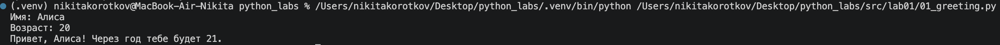
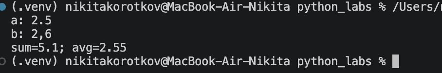
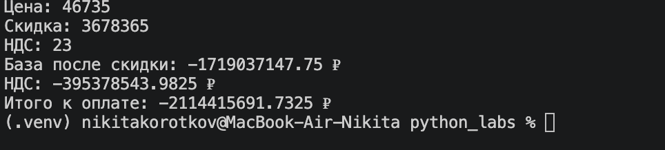
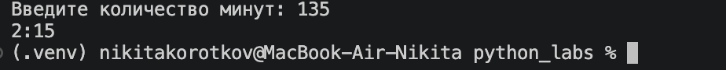
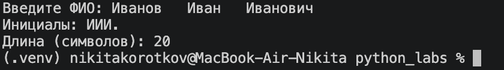
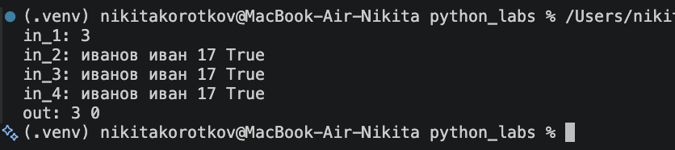
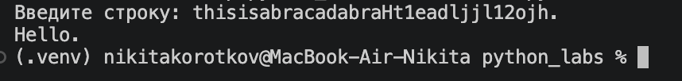

# Lab01-Ввод/вывод и форматирование
____
### Ex01
Ввод и вывод имени и возраста через год
```python
name = input('Имя: ')
age = int(input('Возраст: '))
print(f'Привет, {name}! Через год тебе будет {age+1}.')
```

____
### Ex02
Сумма и ср значение чисел float, получаем на вход два числа и считаем их ср знач и сумму
```python
a = float(input('a: ').replace(',', '.'))
b = float(input('b: ').replace(',', '.'))
print(f'sum={a+b}; avg={(a+b)/2}')
```

____
### Ex03
Счет оплаты, получает данные о акции и ндс считаем итоговую цену с ними
```python
price = float(input('Цена: '))
discount = float(input('Скидка: '))
vat = float(input('НДС: '))
base = price * (1 - discount/100)
vat_amount = base * (vat/100)
total = base + vat_amount
print(f'База после скидки: {float(base)} ₽')
print(f'НДС: {float(vat_amount)} ₽')
print(f'Итого к оплате: {float(total)} ₽')
```

____
### Ex04
Получаем на ввод целое кол-во минут, находим кол-во часов и минут -> выводим
```python
m = int(input('Введите количество минут: '))
h = m // 60
mm = m % 60
print(f'{h}:{mm:02d}')
```

____
### Ex05
Получаем ФИО через ввод с помощью .split() разделяем их на слова и берем инициалы, далее меряем длину строки
```python
fio = input('Введите ФИО: ')
print(f'Инициалы: {fio.split()[0][0]}{fio.split()[1][0]}{fio.split()[2][0]}.')
print(f'Длина (символов): {len(' '.join(fio.split()))}')
```

____
### Ex06
Вводим числа, с помощью while смотрим до кол-ва имен, смотрим False or True, и считаем
```python
n = int(input('Введите число: '))
cnt = 0
ochno = 0
zaochno = 0
while cnt < n:
    s = list(input().split())
    cnt+=1
    if s[3] == 'True':
        ochno+=1
    else:
        zaochno+=1
print(ochno, zaochno)
```

____
### Ex07
Считываем строку, проходимся по ней циклом for и ищем первую заглавную букву, после циклом ищем первую цифру и берем индекс +1, далее от этого индекса до конца строки проходимся с шагом index_LOW - index_UP и добавляем буквы
```python
string = input('Введите строку: ')
final_string = ''
ind_up = 0
ind_low = 0
for i in string:
    if i in "ABCDEFGHIJKLMNOPQRSTUVWXYZ":
        final_string += i
        ind_up = string.index(i)
        break
for j in string:
    if j in '1234567890':
        ind = string.index(j)+1
        ind_low = string.index(j)+1
        break
for i in range(ind_low, len(string), ind_low-ind_up):
    final_string += string[i]

print(final_string)
```

____