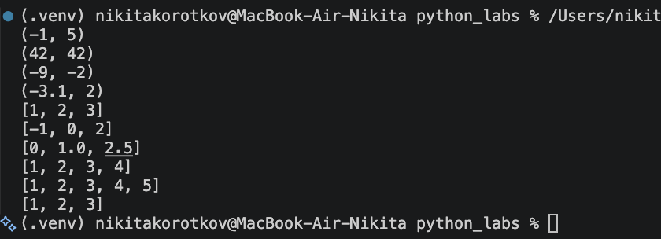
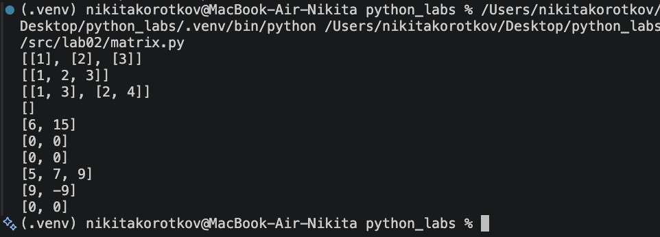
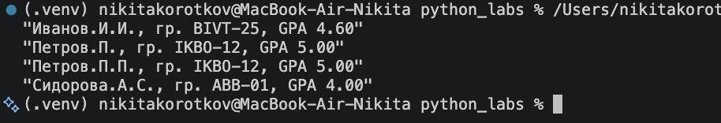

# Lab02-Коллекции и матрицы (list/tuple/set/dict)
---
### Ex01
```python 
def min_max(nums: list[float | int]) -> tuple[float | int, float | int]:
    '''
    Вернуть кортеж (минимум, максимум). Если список пуст — ValueError.
    '''
    if len(nums) == 0:
        raise ValueError("Список не должен быть пустым")
    return (min(nums), max(nums))


def unique_sorted(nums: list[float | int]) -> list[float | int]:
    '''
    Вернуть отсортированный список уникальных значений (по возрастанию).
    '''
    if len(nums) == 0:
            raise ValueError("Список не должен быть пустым")
    nums = set(nums)
    return list(tuple(sorted(nums)))

def flatten(mat: list[list | tuple]) -> list:
    '''
    «Расплющить» список списков/кортежей в один список по строкам (row-major). 
    Если встретилась строка/элемент, который не является списком/кортежем — TypeError.
    '''
    final_list = []
    for i in mat:
        if type(i)!= list and type(i)!= tuple:
            raise TypeError('строка не строка строк матрицы')
        final_list.extend(i)
    return final_list
```

---
### Ex02
```python
def transpose(mat: list[list[float | int]]) -> list[list]:
    '''
    Поменять строки и столбцы местами. Пустая матрица [] → [].
    Если матрица «рваная» (строки разной длины) — ValueError.
    '''
    if len(mat) == 0:
        return []
    cnt = mat[0]
    final_list = []
    for i in mat:
        if len(i) != len(cnt):
            raise ValueError('рваная матрица')
    return [list(i) for i in zip(*mat)]

def row_sums(mat: list[list[float | int]]) -> list[float]:
    '''
    Сумма по каждой строке. Требуется прямоугольность 
    '''
    final_list = []
    cnt = mat[0]
    for i in mat:
        if len(i)!=len(cnt):
              raise ValueError('рваная матрица')
        final_list.append(sum(i))
    return final_list


def col_sums(mat: list[list[float | int]]) -> list[float]:
    '''
    Сумма по каждому столбцу. Требуется прямоугольность.
    '''
    final_list = [i*0 for i in range(len(mat[0]))]
    cnt = mat[0]
    for i in mat:
        if len(i)!=len(cnt):
            raise ValueError('рваная матрица')
        for j in range(len(i)):
            final_list[j]+=i[j]
    return final_list
```

---
### Ex03
```python
def format_record(rec: tuple[str, str, float]) -> str:
    '''
    Функция берет данные из кортежа, проверяет сколько слов в фио, если их не из диапозона от 2 до 3,
    то вызыватя ValueError потоиу что не так введены данные
    Далее проверяетя корректность ввода gpa если тип данных не тот, то вызывается 
    TypeError
    Далее формируеются данные для строки вывода и все)
    '''
    if type(rec) is not tuple:
        raise ValueError('Должен быть кортеж')
    if len(rec) != 3:
        raise ValueError('Длина должна быть 3')
    fio, group, gpa = rec
    if len(list(fio.split())) not in range(2,4):
        raise ValueError('Не та длинна фио')
    if type(fio) is not str:
        raise ValueError('ФИО должны юыть строкой')
    if type(gpa) is not float:
        raise TypeError('Не тот тип данных gpa')
    if gpa <= 0.0 or gpa => 5.0:
        raise ValueError('GPA должен быть в диапозоне от 0.0 до 5.0')
    if len(group) == 0:
        raise ValueError('Пустая группа')
    if type(group) is not str:
        raise ValueError('Группа должна быть строкой ')
    fio = list(fio.strip().split())
    flag = False 
    if len(fio) == 3:
        flag = True
    surname = fio[0].capitalize()+'.'
    initials = ''
    if flag:
        initials+=str(fio[1][0].upper()+'.')
        initials+=str(fio[2][0].upper()+'.')
    else :
        initials+=str(fio[1][0].upper()+'.')
    return f'"{surname}{initials}, гр. {group}, GPA {gpa:.2f}"'
```
