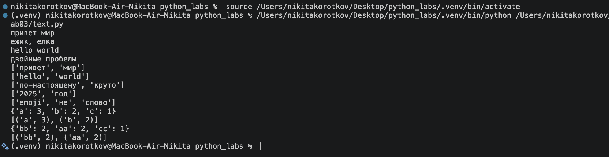
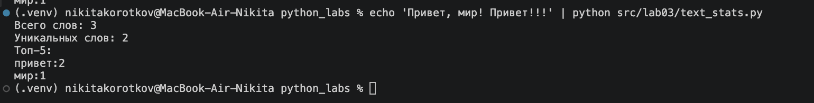

# Lab03 — Тексты и частоты слов (словарь/множество)

---
### Ex01
```python
import re 
def normalize(text: str, *, casefold: bool = True, yo2e: bool = True) -> str:
    '''
    Нормализуем строку 
    assert normalize("ПрИвЕт\nМИр\t") == "привет мир"
    assert normalize("ёжик, Ёлка") == "ежик, елка"
    '''
    if casefold:
        text = text.casefold()
    else:
        text = text.lower()
    if yo2e:
        text = text.replace("ё", "е").replace("Ё", "Е")

    return " ".join(text.split())

def tokenize(text: str) -> list[str]:
    '''
    Ищу все норм слова 
    assert tokenize("привет, мир!") == ["привет", "мир"]
    assert tokenize("по-настоящему круто") == ["по-настоящему", "круто"]
    assert tokenize("2025 год") == ["2025", "год"]

    '''
    words = re.findall(r"[A-Za-zА-Яа-яЁё0-9]+(?:-[A-Za-zА-Яа-яЁё0-9]+)*", text)
    return words

def count_freq(tokens: list[str]) -> dict[str, int]:
    '''
    Перебираем строку и создаем словарь со словами и их кол-вом 
    freq = count_freq(["a","b","a","c","b","a"])
    assert freq == {"a":3, "b":2, "c":1}
    assert top_n(freq, 2) == [("a",3), ("b",2)]
    '''
    dictionary = {}
    for item in tokens:
        if item not in dictionary:
            dictionary[item]=1
        else:
            dictionary[item]+=1
    return dictionary

def top_n(freq: dict[str, int], n: int = 5) -> list[tuple[str, int]]:
    '''
    Сортируем полученный список
    freq2 = count_freq(["bb","aa","bb","aa","cc"])
    assert top_n(freq2, 2) == [("aa",2), ("bb",2)]
    '''
    sorted_freq = list(sorted(freq.items(), key=lambda x: (x[1], len(x[0])), reverse=True))
    return sorted_freq[:n]
```



---
### Ex02
```python
import sys
from text import normalize, tokenize, count_freq, top_n

text = sys.stdin.read()
tokens = tokenize(normalize(text))
freq = count_freq(tokens)
print(f"Всего слов: {len(tokens)}")
print(f"Уникальных слов: {len(freq)}")
print("Топ-5:")
for word, count in top_n(freq):
    print(f"{word}:{count}")
```


